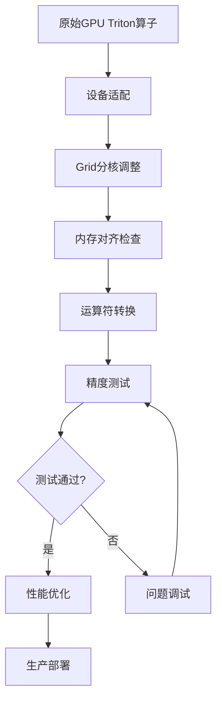

# Triton算子自动迁移到昇腾NPU技能总结

**文档版本**: v3.0  
**创建日期**: 2025-01-18  
**适用范围**: Triton算子从GPU到昇腾NPU的自动化迁移  
**文档来源**: 结合triton-ascend官方文档与实际迁移经验

---

## 目录

1. [迁移概述](#1-迁移概述)
2. [核心差异与迁移原则](#2-核心差异与迁移原则)
3. [自动迁移流程](#3-自动迁移流程)
4. [代码转换规则](#4-代码转换规则)
5. [精度测试用例设计](#5-精度测试用例设计)
6. [调试技巧与工具](#6-调试技巧与工具)
7. [性能优化指南](#7-性能优化指南)
8. [常见问题与解决方案](#8-常见问题与解决方案)
9. [最佳实践清单](#9-最佳实践清单)
10. [参考资源](#10-参考资源)

---

## 1. 迁移概述

### 1.1 迁移目标

将GPU上开发的Triton算子迁移到昇腾NPU平台，确保：
- **功能正确性**: 算子逻辑与GPU版本一致
- **数值精度**: 输出结果在可接受误差范围内
- **性能优化**: 充分利用NPU硬件特性

### 1.2 迁移范围

| 迁移内容 | 说明 |
|---------|------|
| **设备适配** | cuda → npu 设备转换 |
| **内存模型** | GPU逻辑grid → NPU物理核绑定 |
| **数据对齐** | 32字节(VV算子) / 512字节(CV算子)对齐 |
| **运算符适配** | 逻辑运算符 → 位运算符转换 |
| **性能优化** | Autotune、Tiling、存算并行等 |

### 1.3 成功案例

已成功迁移算子：
- ✅ **fused_recurrent_gated_delta_rule_fwd**: 矩阵乘法优化、内存对齐
- ✅ **index_select**: 逻辑运算符陷阱修复（`and` → `&`）

---

## 2. 核心差异与迁移原则

### 2.1 架构差异对比

| 维度 | GPU (NVIDIA) | 昇腾NPU (Ascend) |
|------|--------------|------------------|
| **计算核心** | CUDA Core + Tensor Core | AI Core (Cube + Vector) |
| **核数规模** | 几十到几百SM | 几十AI Core |
| **Grid本质** | 逻辑任务维度（解耦物理核） | 物理核组映射（绑定AI Core拓扑） |
| **并发限制** | grid维度/大小无硬限制 | grid大小 ≤ AI Core总数 (≤65535) |
| **内存对齐** | 无强制要求 | VV: 32字节 / CV: 512字节 |

### 2.2 迁移核心原则

#### 原则1: 放弃GPU「逻辑grid自由定义」
```python
# ❌ GPU写法：逻辑grid自由定义
grid = (triton.cdiv(n_elements, BLOCK_SIZE),)

# ✅ NPU写法：物理核组绑定
import torch_npu
import triton.runtime.driver as driver

device = torch_npu.npu.current_device()
properties = driver.active.utils.get_device_properties(device)
num_cores = properties["num_aicore"]  # 或 num_vectorcore

grid = (num_cores,)  # 固定为物理核数
```

#### 原则2: 内存对齐要求
- **VV算子** (仅Vector Core): 尾轴大小需被 **32字节** 整除
- **CV算子** (Cube + Vector): 尾轴大小需被 **512字节** 整除

```python
# 数据类型字节数
# float16/bfloat16: 2字节
# float32: 4字节
# int32: 4字节

# 示例：float16类型，VV算子
# 尾轴大小需满足: size * 2 % 32 == 0
# 即 size % 16 == 0
```

#### 原则3: 运算符适配（关键陷阱）

**⚠️ 最常见错误**: 在Triton kernel中使用逻辑运算符 `and`/`or` 而非位运算符 `&`/`|`

```python
# ❌ 错误写法：使用逻辑运算符（导致精度误差或NaN）
mask1 = offsets < n_elements
mask2 = offsets >= 0
valid_mask = mask1 and mask2  # 错误！

# ✅ 正确写法：使用位运算符
valid_mask = mask1 & mask2  # 正确！

# 原因：Triton编译器对逻辑运算符的处理在NPU上可能产生非预期结果
```

**实际案例**: index_select算子迁移中，将 `and` 改为 `&` 后，精度从NaN恢复正常。

---

## 3. 自动迁移流程

### 3.1 标准迁移流程



### 3.2 详细步骤

#### 步骤1: 环境准备

```bash
# 1. 安装Triton-Ascend
pip uninstall triton  # 卸载社区Triton
pip install triton-ascend

# 2. 安装PyTorch NPU适配
pip install torch-npu

# 3. 验证安装
python -c "import torch_npu; print(torch_npu.npu.is_available())"
```

#### 步骤2: 设备适配

```diff
import torch
+ import torch_npu
import triton
import triton.language as tl

- DEVICE = triton.runtime.driver.active.get_active_torch_device()
- x = torch.rand(size, device='cuda')
+ x = torch.rand(size, device='npu')

- assert x.device == DEVICE and y.device == DEVICE
```

#### 步骤3: Grid分核调整

```python
# 获取物理核数
import torch_npu
import triton.runtime.driver as driver

device = torch_npu.npu.current_device()
properties = driver.active.utils.get_device_properties(device)

# 根据算子类型选择核数
if is_vector_only_kernel:
    num_cores = properties["num_vectorcore"]
else:  # CV融合算子
    num_cores = properties["num_aicore"]

# 方案1: 固定核数 + 核内循环（推荐）
@triton.jit
def kernel_func(..., NUM_CORE: tl.constexpr):
    pid = tl.program_id(0)
    NUM_BLOCKS = tl.cdiv(n_elements, BLOCK_SIZE)
    
    # 跨步分配任务，充分利用所有核
    for block_idx in range(pid, NUM_BLOCKS, NUM_CORE):
        # 处理当前block
        ...

# 启动kernel
grid = (num_cores,)
kernel_func[grid](..., NUM_CORE=num_cores)

# 方案2: 使用环境变量自动优化
export TRITON_ALL_BLOCKS_PARALLEL=1
```

#### 步骤4: 内存对齐优化

```python
# 检查尾轴对齐
def check_alignment(tensor_shape, dtype, kernel_type='VV'):
    """检查张量尾轴是否满足NPU对齐要求"""
    element_size = torch.tensor([], dtype=dtype).element_size()
    last_dim = tensor_shape[-1]
    
    if kernel_type == 'VV':
        alignment = 32  # 字节
    else:  # CV
        alignment = 512
    
    required_alignment = alignment // element_size
    is_aligned = (last_dim % required_alignment) == 0
    
    if not is_aligned:
        print(f"⚠️ 尾轴{last_dim}不满足对齐要求（需被{required_alignment}整除）")
        # 建议转置或padding
    
    return is_aligned

# 转置优化示例
# 原始: tensor [2048, 3], bfloat16
# 问题: 尾轴3不满足16的倍数（VV算子要求）
# 解决: 借轴转置
conv_state = tl.load(conv_state_ptr + ...)  # 当成1D tensor load
conv_state_T = conv_state.reshape(128, 16*3).trans().reshape(16, 3*128).trans()
```

#### 步骤5: 运算符转换

```python
# 自动检测并转换逻辑运算符
def convert_logical_operators(kernel_source):
    """将Triton kernel中的逻辑运算符转换为位运算符"""
    replacements = {
        ' and ': ' & ',
        ' or ': ' | ',
        'not ': '~',  # 注意：not可能需要特殊处理
    }
    
    for old, new in replacements.items():
        kernel_source = kernel_source.replace(old, new)
    
    return kernel_source

# 手动检查清单
# ✅ 检查所有mask运算
# ✅ 检查条件表达式
# ✅ 检查where语句中的条件
```

#### 步骤6: 精度测试

```python
import torch
import torch_npu

def test_accuracy():
    # 设置随机种子
    torch.manual_seed(42)
    torch.npu.manual_seed(42)
    
    # 准备测试数据
    x = torch.randn(1024, device='npu', dtype=torch.float16)
    y = torch.randn(1024, device='npu', dtype=torch.float16)
    
    # PyTorch参考结果
    ref = x + y
    
    # Triton算子结果
    result = triton_add(x, y)
    
    # 精度比对
    if x.dtype == torch.float16:
        rtol, atol = 1e-3, 1e-3
    elif x.dtype == torch.float32:
        rtol, atol = 1e-4, 1e-4
    
    torch.testing.assert_close(result, ref, rtol=rtol, atol=atol)
    print("✅ 精度测试通过")
```

---

## 4. 代码转换规则

### 4.1 必须修改的代码

| GPU代码 | NPU代码 | 说明 |
|---------|---------|------|
| `device='cuda'` | `device='npu'` | 设备指定 |
| `torch.cuda.is_available()` | `torch.npu.is_available()` | 设备检查 |
| `grid = (triton.cdiv(n, BLOCK),)` | `grid = (num_cores,)` | Grid分核 |
| `mask1 and mask2` | `mask1 & mask2` | 逻辑运算符 |
| `mask1 or mask2` | `mask1 \| mask2` | 逻辑运算符 |

### 4.2 建议优化的代码

| 优化项 | GPU代码 | NPU优化代码 |
|--------|---------|-------------|
| **数据加载** | `tl.load(ptr + idx, mask=m)` | `tl.load(ptr + idx, mask=m, care_padding=False)` |
| **Tiling** | 单次处理全部数据 | 使用for循环分块处理 |
| **Autotune** | 手动配置BLOCK_SIZE | 使用autotune自动调优 |
| **数据类型** | int64运算 | 改用int32（性能更好） |

### 4.3 完整迁移示例

```python
# ==================== 原始GPU版本 ====================
import torch
import triton
import triton.language as tl

DEVICE = triton.runtime.driver.active.get_active_torch_device()

@triton.jit
def add_kernel_gpu(x_ptr, y_ptr, out_ptr, n, BLOCK_SIZE: tl.constexpr):
    pid = tl.program_id(axis=0)
    block_start = pid * BLOCK_SIZE
    offsets = block_start + tl.arange(0, BLOCK_SIZE)
    mask = offsets < n and offsets >= 0  # ❌ 使用逻辑运算符
    x = tl.load(x_ptr + offsets, mask=mask)
    y = tl.load(y_ptr + offsets, mask=mask)
    out = x + y
    tl.store(out_ptr + offsets, out, mask=mask)

def add_gpu(x, y):
    assert x.device == DEVICE and y.device == DEVICE
    out = torch.empty_like(x)
    n = out.numel()
    grid = lambda meta: (triton.cdiv(n, meta['BLOCK_SIZE']),)
    add_kernel_gpu[grid](x, y, out, n, BLOCK_SIZE=1024)
    return out

# ==================== 迁移后NPU版本 ====================
import torch
import torch_npu  # 新增
import triton
import triton.language as tl
import triton.runtime.driver as driver  # 新增

# 获取物理核数
device = torch_npu.npu.current_device()
properties = driver.active.utils.get_device_properties(device)
NUM_CORES = properties["num_aicore"]

@triton.jit
def add_kernel_npu(x_ptr, y_ptr, out_ptr, n, 
                   BLOCK_SIZE: tl.constexpr,
                   NUM_CORE: tl.constexpr):  # 新增参数
    pid = tl.program_id(axis=0)
    NUM_BLOCKS = tl.cdiv(n, BLOCK_SIZE)
    
    # 跨步分配任务
    for block_idx in range(pid, NUM_BLOCKS, NUM_CORE):
        block_start = block_idx * BLOCK_SIZE
        offsets = block_start + tl.arange(0, BLOCK_SIZE)
        mask = (offsets < n) & (offsets >= 0)  # ✅ 使用位运算符
        x = tl.load(x_ptr + offsets, mask=mask, care_padding=False)  # 优化
        y = tl.load(y_ptr + offsets, mask=mask, care_padding=False)
        out = x + y
        tl.store(out_ptr + offsets, out, mask=mask)

def add_npu(x, y):
    out = torch.empty_like(x)
    n = out.numel()
    grid = (NUM_CORES,)  # 固定核数
    add_kernel_npu[grid](x, y, out, n, BLOCK_SIZE=1024, NUM_CORE=NUM_CORES)
    return out

# ==================== 测试代码 ====================
torch.manual_seed(42)
x = torch.randn(98432, device='npu', dtype=torch.float16)
y = torch.randn(98432, device='npu', dtype=torch.float16)

ref = x + y
result = add_npu(x, y)

torch.testing.assert_close(result, ref, rtol=1e-3, atol=1e-3)
print("✅ 迁移成功！")
```

---

## 5. 精度测试用例设计

### 5.1 测试用例模板

```python
"""
Triton算子精度测试模板
使用方法: 复制此文件，修改kernel_func和test_cases
"""
import torch
import torch_npu
import triton
import triton.language as tl
import pytest

# ==================== 配置区 ====================
KERNEL_NAME = "your_kernel_name"
SUPPORTED_DTYPES = [torch.float16, torch.float32, torch.bfloat16]

# ==================== Kernel定义 ====================
@triton.jit
def your_kernel(..., BLOCK_SIZE: tl.constexpr):
    # 实现你的kernel
    pass

def triton_impl(...):
    # Triton实现封装
    pass

def torch_ref(...):
    # PyTorch参考实现
    pass

# ==================== 测试套件 ====================
class TestKernelAccuracy:
    """精度测试套件"""
    
    @pytest.mark.parametrize('dtype', SUPPORTED_DTYPES)
    def test_basic_accuracy(self, dtype):
        """基础精度测试"""
        torch.manual_seed(42)
        # 测试代码...
    
    @pytest.mark.parametrize('size', [1024, 4096, 16384])
    def test_different_scales(self, size):
        """不同规模测试"""
        # 测试代码...
    
    @pytest.mark.parametrize('dtype', [torch.float16, torch.float32])
    def test_edge_cases(self, dtype):
        """边界情况测试"""
        # 测试代码...
    
    def test_numerical_stability(self):
        """数值稳定性测试"""
        # 测试代码...

# ==================== 辅助函数 ====================
def compare_results(result, reference, dtype):
    """结果比对函数"""
    if dtype in [torch.float16, torch.bfloat16]:
        rtol, atol = 1e-3, 1e-3
    elif dtype == torch.float32:
        rtol, atol = 1e-4, 1e-4
    else:  # 整数类型
        assert torch.equal(result, reference)
        return
    
    torch.testing.assert_close(result, reference, rtol=rtol, atol=atol)

if __name__ == "__main__":
    pytest.main([__file__, "-v"])
```

### 5.2 测试用例设计要点

#### 5.2.1 测试覆盖维度

| 维度 | 测试内容 | 示例值 |
|------|---------|--------|
| **数据类型** | float16, float32, bfloat16, int32 | `@pytest.mark.parametrize('dtype', [...])` |
| **数据规模** | 小/中/大规模 | `[1024, 4096, 16384, 65536]` |
| **边界情况** | 空张量、单元素、大索引 | `[0, 1, 10000]` |
| **特殊值** | 0、极值、NaN、Inf | `[0.0, 1e-10, 1e10]` |
| **随机性** | 固定种子 vs 随机种子 | `seed=42` vs `seed=None` |

#### 5.2.2 精度容差标准

```python
# 根据数据类型设置容差
TOLERANCE = {
    torch.float16: {'rtol': 1e-3, 'atol': 1e-3},
    torch.bfloat16: {'rtol': 1e-3, 'atol': 1e-3},
    torch.float32: {'rtol': 1e-4, 'atol': 1e-4},
    torch.float64: {'rtol': 1e-5, 'atol': 1e-5},
}

def compare_with_tolerance(result, reference, dtype):
    """带容差的精度比对"""
    if dtype in TOLERANCE:
        tol = TOLERANCE[dtype]
        torch.testing.assert_close(result, reference, **tol, equal_nan=True)
    else:
        # 整数类型要求完全相等
        assert torch.equal(result, reference)
```

#### 5.2.3 边界情况测试

```python
def test_edge_cases():
    """边界情况测试套件"""
    
    # 测试1: 空张量
    x = torch.tensor([], device='npu')
    result = kernel_func(x)
    assert result.numel() == 0
    
    # 测试2: 单元素
    x = torch.tensor([1.0], device='npu')
    result = kernel_func(x)
    assert result.shape == (1,)
    
    # 测试3: 大索引值
    indices = torch.tensor([999999], device='npu')
    x = torch.randn(1000000, device='npu')
    result = kernel_func(x, indices)
    assert not torch.isnan(result).any()
    
    # 测试4: 极值
    x = torch.tensor([1e-10, 1e10, -1e10], device='npu')
    result = kernel_func(x)
    assert torch.isfinite(result).all()
```

---

## 6. 调试技巧与工具

### 6.1 调试环境设置

```bash
# 启用调试模式
export TRITON_DEBUG=1
export TRITON_DISABLE_CACHE=1

# 查看中间文件
# 编译产物保存在: ~/.triton/dump/
# - kernel.ttir.mlir: Triton IR
# - kernel.ttadapter.mlir: Ascend适配器IR
```

### 6.2 常用调试方法

#### 方法1: 解释器模式（CPU基准）

```python
import os
os.environ['TRITON_INTERPRET'] = '1'  # 在CPU上运行kernel

# 运行kernel，获取CPU结果作为基准
result_cpu = triton_kernel[grid](...)

# 对比NPU结果
os.environ['TRITON_INTERPRET'] = '0'
result_npu = triton_kernel[grid](...)

# 比较差异
diff = torch.abs(result_cpu - result_npu)
print(f"最大差异: {diff.max()}")
```

#### 方法2: 打印调试

```python
@triton.jit
def debug_kernel(x_ptr, out_ptr, n, BLOCK_SIZE: tl.constexpr):
    pid = tl.program_id(0)
    offsets = pid * BLOCK_SIZE + tl.arange(0, BLOCK_SIZE)
    
    # 打印中间值
    tl.device_print("pid:", pid)
    tl.device_print("offsets:", offsets)
    
    x = tl.load(x_ptr + offsets, mask=offsets < n)
    tl.device_print("loaded x:", x)
    
    out = x * 2
    tl.store(out_ptr + offsets, out, mask=offsets < n)
```

#### 方法3: NaN问题定位

```python
def debug_nan_issue():
    """NaN问题调试脚本"""
    import torch
    import torch_npu
    
    # 固定随机种子测试
    torch.manual_seed(42)
    x = torch.randn(1024, device='npu', dtype=torch.float16)
    
    result = triton_kernel(x)
    
    # 检查NaN
    if torch.isnan(result).any():
        nan_mask = torch.isnan(result)
        nan_indices = torch.where(nan_mask)
        print(f"❌ 发现NaN！位置: {nan_indices}")
        print(f"对应输入值: {x[nan_indices]}")
        
        # 检查输入
        print(f"输入是否包含NaN: {torch.isnan(x).any()}")
        print(f"输入是否包含Inf: {torch.isinf(x).any()}")
    else:
        print("✅ 无NaN问题")
```

#### 方法4: IR文件分析

```bash
# 1. 启用调试输出
export TRITON_DEBUG=1

# 2. 运行kernel
python your_kernel.py

# 3. 查看IR文件
cd ~/.triton/dump/<hash>/
cat kernel.ttir.mlir      # Triton IR
cat kernel.ttadapter.mlir # Ascend适配器IR

# 4. 对比IR差异
diff kernel.ttir.mlir expected.ttir.mlir
```

### 6.3 调试模板脚本

```python
"""
Triton算子调试模板
使用方法: 修改kernel_func和测试参数
"""
import torch
import torch_npu
import os

def debug_kernel():
    """完整调试流程"""
    
    # 1. 设置调试环境
    os.environ['TRITON_DEBUG'] = '1'
    os.environ['TRITON_DISABLE_CACHE'] = '1'
    
    # 2. 准备测试数据
    torch.manual_seed(42)
    x = torch.randn(1024, device='npu', dtype=torch.float16)
    
    # 3. CPU解释器模式测试
    os.environ['TRITON_INTERPRET'] = '1'
    result_cpu = your_kernel(x)
    
    # 4. NPU模式测试
    os.environ['TRITON_INTERPRET'] = '0'
    result_npu = your_kernel(x)
    
    # 5. 对比结果
    print("=== 结果对比 ===")
    print(f"CPU结果: {result_cpu[:10]}")
    print(f"NPU结果: {result_npu[:10]}")
    
    diff = torch.abs(result_cpu - result_npu)
    print(f"最大差异: {diff.max()}")
    print(f"平均差异: {diff.mean()}")
    
    # 6. 检查NaN/Inf
    print("\n=== 数值检查 ===")
    print(f"CPU NaN数量: {torch.isnan(result_cpu).sum()}")
    print(f"NPU NaN数量: {torch.isnan(result_npu).sum()}")
    print(f"CPU Inf数量: {torch.isinf(result_cpu).sum()}")
    print(f"NPU Inf数量: {torch.isinf(result_npu).sum()}")
    
    # 7. 定位最大误差位置
    max_diff_idx = torch.argmax(diff)
    print(f"\n=== 最大误差位置 ===")
    print(f"索引: {max_diff_idx}")
    print(f"CPU值: {result_cpu[max_diff_idx]}")
    print(f"NPU值: {result_npu[max_diff_idx]}")
    print(f"输入值: {x[max_diff_idx]}")

if __name__ == "__main__":
    debug_kernel()
```

---

## 7. 性能优化指南

### 7.1 Autotune自动调优

#### 7.1.1 基础Autotune

```python
import triton

def get_autotune_config():
    """定义候选配置"""
    return [
        triton.Config({'BLOCK_SIZE': 1024, 'multibuffer': True}),
        triton.Config({'BLOCK_SIZE': 2048, 'multibuffer': True}),
        triton.Config({'BLOCK_SIZE': 4096, 'multibuffer': False}),
    ]

@triton.autotune(
    configs=get_autotune_config(),
    key=['n_elements'],  # 触发重新调优的参数
)
@triton.jit
def kernel_func(..., BLOCK_SIZE: tl.constexpr):
    # kernel实现
    pass
```

#### 7.1.2 进阶Autotune（自动生成配置）

```python
import triton
import triton.backends.ascend.runtime  # 必须导入

@triton.autotune(
    configs=[],  # 空列表，自动生成配置
    key=['n_elements'],
    hints={
        'split_params': {'x': 'BLOCK_SIZE'},
        'tiling_params': {'x': 'BLOCK_SUB'},
        'low_dim_axes': ['x'],
        'reduction_axes': [],
    }
)
@triton.jit
def kernel_func(..., BLOCK_SIZE: tl.constexpr, BLOCK_SUB: tl.constexpr):
    # kernel实现
    pass
```

### 7.2 Tiling优化

```python
@triton.jit
def optimized_kernel(..., BLOCK_SIZE: tl.constexpr, BLOCK_SUB: tl.constexpr):
    """使用Tiling优化性能"""
    pid = tl.program_id(0)
    base_offset = pid * BLOCK_SIZE
    
    # 计算子块数量
    num_sub_blocks = BLOCK_SIZE // BLOCK_SUB
    
    # 循环处理每个子块
    for sub_idx in range(num_sub_blocks):
        sub_offset = base_offset + sub_idx * BLOCK_SUB
        offsets = sub_offset + tl.arange(0, BLOCK_SUB)
        mask = offsets < n_elements
        
        # 加载、计算、存储
        data = tl.load(in_ptr + offsets, mask=mask)
        result = compute(data)
        tl.store(out_ptr + offsets, result, mask=mask)
```

### 7.3 存算并行优化

```python
@triton.jit
def parallel_kernel(..., BLOCK_SIZE: tl.constexpr):
    """启用存算并行"""
    pid = tl.program_id(0)
    offsets = pid * BLOCK_SIZE + tl.arange(0, BLOCK_SIZE)
    mask = offsets < n_elements
    
    # 使用care_padding=False提升并行度
    x = tl.load(x_ptr + offsets, mask=mask, care_padding=False)
    
    result = compute(x)
    
    tl.store(out_ptr + offsets, result, mask=mask)
```

### 7.4 数据类型优化

```python
# ❌ 避免使用int64（性能差）
@triton.jit
def slow_kernel(x_ptr, y_ptr, ..., BLOCK_SIZE: tl.constexpr):
    offsets = tl.arange(0, BLOCK_SIZE)  # 默认int64
    x = tl.load(x_ptr + offsets)  # Vector ADD退化为标量运算
    ...

# ✅ 使用int32或float32
@triton.jit
def fast_kernel(x_ptr, y_ptr, ..., BLOCK_SIZE: tl.constexpr):
    offsets = tl.arange(0, BLOCK_SIZE).to(tl.int32)  # 转为int32
    x = tl.load(x_ptr + offsets)  # 高效向量运算
    ...
```

### 7.5 编译优化选项

```python
def get_autotune_config():
    return [
        triton.Config({
            'BLOCK_SIZE': 2048,
            'multibuffer': True,           # 开启流水并行
            'unit_flag': True,              # Cube优化
            'tile_mix_vector_loop': [2, 4], # Vector切分
        }),
    ]
```

---

## 8. 常见问题与解决方案

### 8.1 问题分类速查表

| 问题类型 | 典型表现 | 首选调试方法 |
|---------|---------|-------------|
| **精度问题** | NPU结果与参考不一致 | 解释器模式 + 打印调试 |
| **编译错误** | MLIRCompileError | 查看IR文件 |
| **coreDim超限** | coreDim > 65535 | 增大BLOCK_SIZE或启用TRITON_ALL_BLOCKS_PARALLEL |
| **UB溢出** | ub overflow | 减小BLOCK_SIZE或使用Tiling |
| **NaN输出** | 结果包含NaN | 检查逻辑运算符 + 输入数据 |
| **性能差** | 执行时间长 | Autotune + Tiling优化 |

### 8.2 详细问题解决方案

#### 问题1: coreDim超限

**错误信息**: `coreDim=xxxx can't be greater than UINT16_MAX`

**原因**: Grid分核数超过65535

**解决方案**:

```python
# 方案1: 启用自动优化
export TRITON_ALL_BLOCKS_PARALLEL=1

# 方案2: 动态计算BLOCK_SIZE
import triton

N = x.numel()
min_block_size = triton.next_power_of_2(triton.cdiv(N, 65535))
BLOCK_SIZE = max(32768, min_block_size)

grid = (triton.cdiv(N, BLOCK_SIZE),)
```

#### 问题2: UB空间溢出

**错误信息**: `ub overflow, requires xxxx bits while 1572684 bits available!`

**原因**: 片上内存（192KB）不足

**解决方案**:

```python
# 方案1: 减小BLOCK_SIZE
BLOCK_SIZE = 1024  # 从2048减小到1024

# 方案2: 使用Tiling分块
@triton.jit
def kernel(..., BLOCK_SIZE: tl.constexpr, BLOCK_SUB: tl.constexpr):
    for i in range(BLOCK_SIZE // BLOCK_SUB):
        # 每次只处理BLOCK_SUB大小的数据
        ...
```

#### 问题3: 精度误差或NaN

**症状**: 输出包含NaN或与参考结果差异大

**调试步骤**:

```python
# 1. 检查逻辑运算符
# ❌ 错误
mask = (a < b) and (c > d)

# ✅ 正确
mask = (a < b) & (c > d)

# 2. 检查输入数据
print(f"输入NaN: {torch.isnan(x).any()}")
print(f"输入Inf: {torch.isinf(x).any()}")

# 3. 使用CPU解释器对比
os.environ['TRITON_INTERPRET'] = '1'
result_cpu = kernel(x)

os.environ['TRITON_INTERPRET'] = '0'
result_npu = kernel(x)

diff = torch.abs(result_cpu - result_npu)
print(f"最大差异: {diff.max()}, 位置: {torch.argmax(diff)}")
```

#### 问题4: 性能不佳

**症状**: 算子执行时间过长

**优化步骤**:

```python
# 1. 使用Autotune
@triton.autotune(configs=[...], key=['n'])
@triton.jit
def kernel(...):
    pass

# 2. 启用存算并行
x = tl.load(ptr + offsets, mask=mask, care_padding=False)

# 3. 使用Tiling
for i in range(num_blocks):
    # 分块处理
    pass

# 4. 优化数据类型
offsets = tl.arange(0, BLOCK_SIZE).to(tl.int32)  # 避免int64

# 5. 检查内存对齐
# 确保尾轴满足对齐要求
```

---

## 9. 最佳实践清单

### 9.1 迁移前检查清单

- [ ] 确认Triton-Ascend已正确安装
- [ ] 确认torch-npu可用
- [ ] 备份原始GPU代码
- [ ] 准备PyTorch参考实现
- [ ] 设计精度测试用例

### 9.2 代码修改清单

- [ ] 将 `device='cuda'` 改为 `device='npu'`
- [ ] 删除GPU设备检查代码
- [ ] 调整Grid分核逻辑（固定核数或启用TRITON_ALL_BLOCKS_PARALLEL）
- [ ] **检查所有逻辑运算符**：`and` → `&`, `or` → `|`
- [ ] 检查内存对齐（VV: 32字节, CV: 512字节）
- [ ] 添加Tiling循环（如果需要）
- [ ] 配置Autotune参数

### 9.3 测试验证清单

- [ ] 基础功能测试（小规模数据）
- [ ] 精度测试（多种数据类型）
- [ ] 边界情况测试（空张量、大索引等）
- [ ] 数值稳定性测试（NaN、Inf检查）
- [ ] 性能测试（与GPU版本对比）

### 9.4 性能优化清单

- [ ] 启用Autotune自动调优
- [ ] 使用Tiling分块处理
- [ ] 启用存算并行（care_padding=False）
- [ ] 优化数据类型（避免int64）
- [ ] 检查内存对齐
- [ ] 使用性能分析工具（msprof）

---

## 10. 参考资源

### 10.1 官方文档

- **Triton-Ascend文档**: `/home/w00664509/triton-ascend/docs/zh/`
  - 迁移指南: `migration_guide/migrate_from_gpu.md`
  - 架构差异: `migration_guide/architecture_difference.md`
  - 性能指南: `migration_guide/performance_guidelines.md`
  - 编程指南: `programming_guide.md`
  - 调试指南: `debug_guide/debugging.md`
  - FAQ: `FAQ.md`

### 10.2 示例代码

- **官方示例**: `/home/w00664509/triton-ascend/docs/zh/examples/`
  - 向量加法: `01_vector_add_example.md`
  - Fused Softmax: `02_fused_softmax_example.md`
  - Layer Norm: `03_layer_norm_example.md`
  - Fused Attention: `04_fused_attention_example.md`
  - 矩阵乘法: `05_matrix_multiplication_example.md`
  - Autotune: `06_autotune_example.md`
  - 精度比对: `07_accuracy_comparison_example.md`

### 10.3 实际迁移案例

- **fused_recurrent_gated_delta_rule_fwd**: `/home/w00664509/vllm-ascend/vllm_ascend/ops/triton/`
- **index_select**: 同上目录
- **迁移总结**: `/home/w00664509/MIGRATION_SUMMARY.md`

### 10.4 工具与模板

- **测试模板**: `/home/w00664509/vllm-ascend/vllm_ascend/ops/triton/test_template.py`
- **调试模板**: `/home/w00664509/vllm-ascend/vllm_ascend/ops/triton/debug_template.py`
- **快速参考**: `/home/w00664509/TRITON_MIGRATION_QUICK_REFERENCE.md`

### 10.5 环境变量速查

| 环境变量 | 作用 | 使用场景 |
|---------|------|---------|
| `TRITON_DEBUG=1` | 启用调试输出，生成IR文件 | 编译问题调试 |
| `TRITON_DISABLE_CACHE=1` | 禁用编译缓存 | 确保每次重新编译 |
| `TRITON_INTERPRET=1` | CPU解释器模式 | 精度问题调试 |
| `TRITON_ALL_BLOCKS_PARALLEL=1` | 自动优化Grid分核 | coreDim超限问题 |
| `TRITON_BENCH_METHOD="npu"` | NPU性能采集方式 | Autotune性能测试 |

---

## 附录A: 关键代码模式速查

### A.1 获取物理核数

```python
import torch_npu
import triton.runtime.driver as driver

device = torch_npu.npu.current_device()
properties = driver.active.utils.get_device_properties(device)

num_aicore = properties["num_aicore"]      # AI Core总数
num_vectorcore = properties["num_vectorcore"]  # Vector Core数
```

### A.2 固定核数 + 跨步分配

```python
@triton.jit
def kernel(..., NUM_CORE: tl.constexpr):
    pid = tl.program_id(0)
    NUM_BLOCKS = tl.cdiv(n, BLOCK_SIZE)
    
    for block_idx in range(pid, NUM_BLOCKS, NUM_CORE):
        # 处理当前block
        pass

grid = (NUM_CORES,)
kernel[grid](..., NUM_CORE=NUM_CORES)
```

### A.3 Tiling分块模式

```python
@triton.jit
def kernel(..., BLOCK_SIZE: tl.constexpr, BLOCK_SUB: tl.constexpr):
    pid = tl.program_id(0)
    base_offset = pid * BLOCK_SIZE
    
    for i in range(BLOCK_SIZE // BLOCK_SUB):
        offsets = base_offset + i * BLOCK_SUB + tl.arange(0, BLOCK_SUB)
        # 处理子块
        pass
```

### A.4 Autotune配置

```python
@triton.autotune(
    configs=[
        triton.Config({'BLOCK_SIZE': 1024, 'multibuffer': True}),
        triton.Config({'BLOCK_SIZE': 2048, 'multibuffer': True}),
    ],
    key=['n_elements'],
)
@triton.jit
def kernel(..., BLOCK_SIZE: tl.constexpr):
    pass
```

---

## 附录B: 错误代码速查

| 错误类型 | 错误信息 | 解决方案 |
|---------|---------|---------|
| **coreDim超限** | `coreDim=xxxx can't be greater than UINT16_MAX` | 增大BLOCK_SIZE或启用`TRITON_ALL_BLOCKS_PARALLEL=1` |
| **UB溢出** | `ub overflow, requires xxxx bits` | 减小BLOCK_SIZE或使用Tiling |
| **编译错误** | `MLIRCompileError` | 查看IR文件，检查语法 |
| **精度误差** | 结果与参考不一致 | 检查逻辑运算符，使用解释器模式 |
| **NaN输出** | 结果包含NaN | 检查逻辑运算符 `and`/`or` → `&`/`|` |

---

**文档维护**: 本文档将持续更新，记录最新的迁移经验和最佳实践。如有问题或建议，请联系开发团队。

**最后更新**: 2025-01-18
